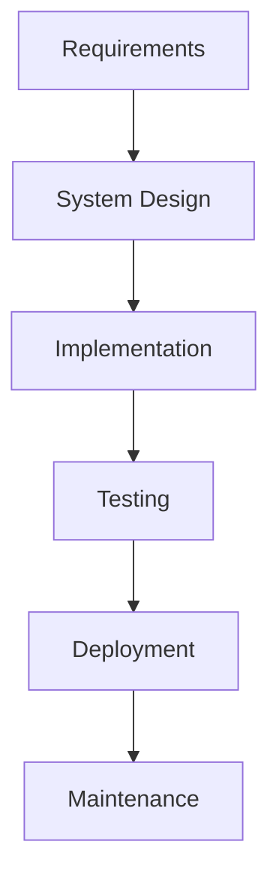
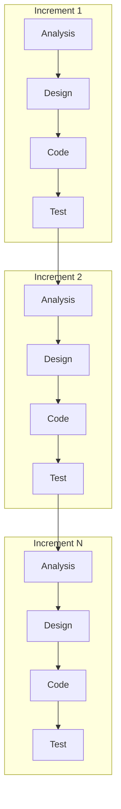
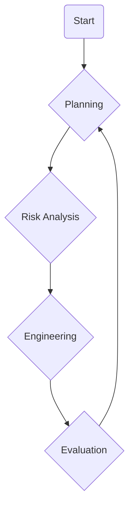

# MODULE-I: INTRODUCTION TO SOFTWARE PROCESS

## 1. Introduction to Software Engineering

Software Engineering is the application of a systematic, disciplined, quantifiable approach to the development, operation, and maintenance of software; that is, the application of engineering to software. It involves using well-defined principles and practices to create high-quality software that meets user needs.

### Key Aspects:
- **Systematic Approach:** Following a structured process from requirements gathering to deployment and maintenance.
- **Disciplined Approach:** Adhering to established methods and standards.
- **Quantifiable Approach:** Using metrics to measure software quality, process efficiency, and project progress.
- **Layered Technology:** Software engineering can be seen as a layered technology with a quality focus at its core, supported by processes, methods, and tools.

## 2. The Software Process

A software process (also known as a software development life cycle or SDLC) is a set of activities and associated results that lead to the production of a software product. It provides a framework for managing software development.

### Common Process Activities:
1.  **Software Specification:** Defining what the system should do.
2.  **Software Development:** Designing and implementing the software.
3.  **Software Validation:** Checking that the software does what the customer wants.
4.  **Software Evolution:** Modifying the software to meet changing customer needs.

## 3. Perspective and Specialized Process Models

### Perspective Process Models (Prescriptive Models)
These models prescribe a set of activities, actions, tasks, and a work-flow for software development.

*   **Waterfall Model:**
    *   A sequential approach where progress flows steadily downwards (like a waterfall) through the phases of conception, initiation, analysis, design, construction, testing, deployment and maintenance.
    *   **Phases:** Requirements, System Design, Implementation, Testing, Deployment, Maintenance.
    *   **Pros:** Simple to understand and use.
    *   **Cons:** Inflexible, not suitable for projects with changing requirements.

*   **Incremental Model:**
    *   Combines elements of the waterfall model applied in an iterative fashion. It delivers a series of releases (increments) that provide progressively more functionality.
    *   **Pros:** Delivers a working version early, more flexible than the waterfall model.
    *   **Cons:** The complete system is not available until the final increment.

*   **Spiral Model:**
    *   A risk-driven process model generator for software projects. It combines features of both prototyping and the waterfall model.
    *   **Phases:** Planning, Risk Analysis, Engineering, Evaluation.
    *   **Pros:** Good for large and complex projects, risk management is a key feature.
    *   **Cons:** Can be complex to manage.

### Specialized Process Models
These models are tailored for specific types of projects or development environments.

*   **Component-Based Development:** Focuses on building systems from existing reusable components.
*   **Formal Methods Model:** Uses mathematical specifications for the design and verification of software.
*   **Aspect-Oriented Software Development:** Focuses on the separation of cross-cutting concerns (e.g., logging, security).

## 4. Introduction to Agility

Agility in software development is the ability to create and respond to change. It is a way of dealing with, and ultimately succeeding in, an uncertain and turbulent environment.

### The Agile Manifesto:
*   **Individuals and interactions** over processes and tools
*   **Working software** over comprehensive documentation
*   **Customer collaboration** over contract negotiation
*   **Responding to change** over following a plan

## 5. The Agile Process

Agile software development comprises various approaches to software development under which requirements and solutions evolve through the collaborative effort of self-organizing and cross-functional teams and their customer(s)/end user(s).

### Key Principles:
*   Customer satisfaction by early and continuous delivery of valuable software.
*   Welcome changing requirements, even late in development.
*   Deliver working software frequently.
*   Business people and developers must work together daily throughout the project.
*   Build projects around motivated individuals.

## 6. Extreme Programming (XP) Process

Extreme Programming (XP) is an agile software development framework that aims to produce higher quality software and higher quality of life for the development team. XP is the most specific of the agile frameworks regarding appropriate engineering practices for software development.

### Core Values:
1.  **Simplicity:** Do what is needed and no more.
2.  **Communication:** Build a shared understanding of the problem and solution.
3.  **Feedback:** Get feedback early and often.
4.  **Courage:** Be prepared to make hard decisions and refactor code when needed.
5.  **Respect:** Respect the expertise of all team members.

### Key Practices:
*   **The Planning Game:** Quickly determine the scope of the next release.
*   **Small Releases:** Put a simple system into production quickly, then release new versions on a very short cycle.
*   **Metaphor:** Guide all development with a simple shared story of how the whole system works.
*   **Simple Design:** The system should be designed as simply as possible at any given moment.
*   **Test-Driven Development (TDD):** Write tests before writing the code.
*   **Refactoring:** Restructure the system without changing its behavior to remove duplication, improve communication, simplify, or add flexibility.
*   **Pair Programming:** All production code is written with two programmers at one machine.
*   **Collective Ownership:** Anyone can change any code anywhere in the system at any time.
*   **Continuous Integration:** Integrate and build the system many times a day.
*   **Sustainable Pace:** Work at a pace that can be sustained indefinitely.
*   **On-site Customer:** A real, live user on the team, available to answer questions.
*   **Coding Standards:** Programmers write all code in accordance with rules emphasizing communication through the code.