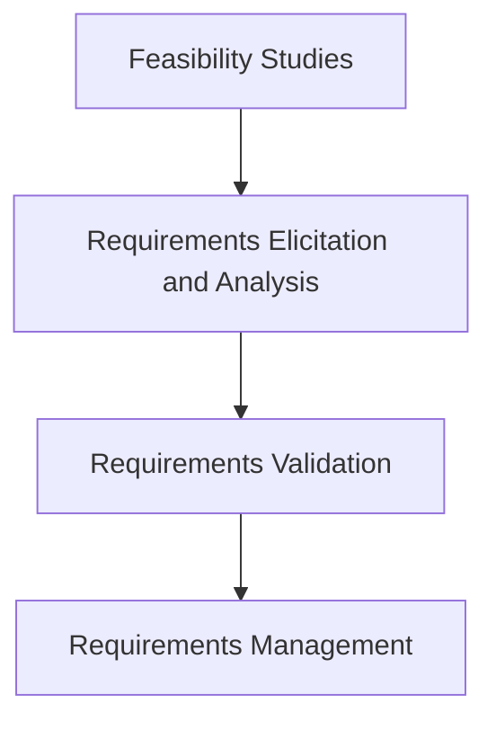

# MODULE-II: REQUIREMENTS ANALYSIS AND SPECIFICATION

## 1. Software Requirements

Software requirements are the features, functions, capabilities, and constraints that a software system must satisfy. They form the bedrock of the software development process, as they define what the system is expected to do and the criteria for its success. A well-defined set of requirements is crucial for avoiding project failure.

### Functional and Non-Functional Requirements

*   **Functional Requirements:**
    *   These define the specific behaviors or functions of the system. They describe what the system should *do*. Functional requirements are often expressed as "The system shall..." statements.
    *   **Examples:**
        *   The user shall be able to search for a customer by name, ID, or email address.
        *   The system shall generate a sales report at the end of each day, which can be exported to PDF or CSV format.
        *   The system shall allow users to pay via credit card, PayPal, or bank transfer.
        *   The system must send an email confirmation to the user after a successful order placement.

*   **Non-Functional Requirements (NFRs):**
    *   These define the quality attributes of the system. They describe *how* the system should perform its functions and are often seen as constraints on the system's design. NFRs are critical for user satisfaction and system usability.
    *   **Categories and Examples:**
        *   **Performance:** How responsive the system is.
            *   The system should respond to user queries within 2 seconds under normal load.
            *   The system must support up to 1000 concurrent users.
        *   **Security:** Protection against unauthorized access or data breaches.
            *   All user data must be encrypted both in transit (using TLS) and at rest.
            *   The system must comply with GDPR regulations.
            *   User passwords must be hashed using a strong algorithm (e.g., bcrypt).
        *   **Reliability:** The availability and dependability of the system.
            *   The system must be available 99.9% of the time (less than 9 hours of downtime per year).
            *   The system should have a Mean Time Between Failures (MTBF) of at least 1000 hours.
        *   **Usability:** The ease with which users can interact with the system.
            *   A new user should be able to learn the basic functions of the system within 30 minutes without formal training.
            *   The user interface must be compliant with Web Content Accessibility Guidelines (WCAG) 2.1 AA.
        *   **Portability:** The ability of the software to be transferred from one environment to another.
            *   The application must be able to run on Windows, macOS, and Linux operating systems.
            *   The web application must be compatible with the latest versions of Chrome, Firefox, and Safari.
        *   **Maintainability:** The ease with which the software can be modified to correct faults, improve performance, or adapt to a changed environment.
            *   The code must follow the company's official style guide.
            *   Code complexity (cyclomatic complexity) should not exceed 10 for any function.

### User and System Requirements

*   **User Requirements:**
    *   High-level statements in natural language, often accompanied by diagrams, that describe the services the system provides and its operational constraints. They are written for the customer and end-users.
    *   They focus on the user's goals and how the system will help them achieve those goals.
    *   **Example:** "The system should allow me to track my sales and generate reports so I can analyze my business performance."

*   **System Requirements:**
    *   A structured document setting out detailed descriptions of the system's functions, services, and operational constraints. It defines what should be implemented and may form part of a contract between the client and the developer.
    *   They are more detailed, specific, and technical than user requirements.
    *   **Example:** "The system shall provide a 'Generate Sales Report' function. The user can specify a date range for the report. The report will include total sales, number of orders, and average order value. The report can be exported as a PDF or CSV file."

### Software Requirements Document (SRD)

A Software Requirements Document (or Specification - SRS) is a comprehensive description of the intended purpose and environment for a software system under development. It serves as a single source of truth for all stakeholders.

#### Typical Structure:
1.  **Introduction:**
    *   **Purpose:** The purpose of the document and the intended audience.
    *   **Scope:** A brief description of the software, its objectives, and the business context.
    *   **Definitions, Acronyms, and Abbreviations:** A glossary of terms.
    *   **References:** A list of any other documents referenced in the SRD.
    *   **System Overview:** A summary of the rest of the document.
2.  **Overall Description:**
    *   **Product Perspective:** The relationship of the product to other products or projects.
    *   **Product Functions:** A summary of the major functions the product will perform.
    *   **User Characteristics:** A description of the intended users of the product.
    *   **Constraints:** Any constraints on the design or implementation (e.g., regulatory policies, hardware limitations).
    *   **Assumptions and Dependencies:** Any assumptions that, if incorrect, will affect the project.
3.  **Specific Requirements:**
    *   **Functional Requirements:** A detailed list of all functional requirements.
    *   **Non-Functional Requirements:** A detailed list of all non-functional requirements.
    *   **Interface Requirements:** Description of how the software will interact with other systems, hardware, or users.
4.  **Appendices:** Any additional information, such as analysis models or prototypes.
5.  **Index:** To help navigate the document.

## 2. Requirement Engineering Process

Requirement Engineering is the systematic process of defining, documenting, and maintaining requirements. It is a crucial phase that sets the stage for the entire software development lifecycle.

### Process Phases:

1.  **Feasibility Studies:**
    *   An analysis to determine if the proposed system is a viable project.
    *   **Technical Feasibility:** Can the system be built with current technology and expertise?
    *   **Economic Feasibility:** Will the system provide a positive return on investment? This involves a cost-benefit analysis.
    *   **Operational Feasibility:** Will the new system be accepted and used by the users? Does it fit within the organization's culture and business processes?

2.  **Requirements Elicitation and Analysis:**
    *   The process of gathering requirements from stakeholders. This is a collaborative process.
    *   **Techniques:**
        *   **Interviews:** Directly talking to stakeholders. **Pros:** Can get detailed information. **Cons:** Can be time-consuming and subject to bias.
        *   **Questionnaires:** Collecting information from a large number of people. **Pros:** Efficient for large groups. **Cons:** Questions can be misinterpreted; difficult to get follow-up information.
        *   **Observation (Shadowing):** Watching users perform their tasks in their natural environment. **Pros:** Provides insights into how users actually work. **Cons:** Users may act differently when being observed (Hawthorne effect).
        *   **Prototyping:** Creating a working model of the system to get early feedback. **Pros:** Excellent for clarifying requirements and getting user buy-in. **Cons:** Users may mistake the prototype for the final system.
        *   **Workshops (JAD sessions):** Bringing stakeholders together in a structured meeting to collaborate on requirements. **Pros:** Can resolve conflicts and build consensus quickly. **Cons:** Can be difficult to schedule and manage.
    *   During analysis, requirements are categorized, prioritized (e.g., using MoSCoW - Must have, Should have, Could have, Won't have), and checked for conflicts, inconsistencies, and completeness.

3.  **Requirements Validation:**
    *   The process of checking that the documented requirements are correct, complete, and consistent. The goal is to ensure that the requirements define the system that the customer really wants.
    *   **Techniques:**
        *   **Requirements Reviews/Walkthroughs:** A team of stakeholders (developers, testers, users) manually reviews the requirements document to find errors and ambiguities.
        *   **Prototyping:** Users can experiment with a prototype to validate that it meets their needs and expectations.
        *   **Test-Case Generation:** Developing tests for each requirement can reveal problems, ambiguities, or missing information in the requirements. If a requirement cannot be tested, it is not a good requirement.

4.  **Requirements Management:**
    *   The process of managing changing requirements throughout the project.
    *   Requirements are rarely static. It's essential to have a formal process for managing changes to avoid scope creep. This involves a change control board (CCB), impact analysis, and version control for the requirements document.
    *   **Traceability:** The ability to describe and follow the life of a requirement, in both a forwards and backwards direction (e.g., from requirement to design to code to test case). Traceability matrices are often used for this.

## 3. Classical Analysis

### Structured System Analysis

*   A traditional method for analyzing and designing systems that focuses on the flow of data through the system.
*   It uses graphical tools to represent the system and its processes in a top-down, modular fashion.
*   **Key Tool: Data Flow Diagrams (DFDs)**
    *   DFDs show how data moves through a system. They are an excellent way to visualize the system's functionality.
    *   **Components:**
        *   **Process:** An activity that transforms data (e.g., "Calculate Total Price"). Represented by a circle or rounded rectangle.
        *   **Data Flow:** The movement of data between processes, data stores, and external entities (e.g., "Customer Order"). Represented by an arrow.
        *   **Data Store:** A place where data is stored (e.g., "Products Database"). Represented by two parallel lines.
        *   **External Entity:** A source or destination of data that is outside the system (e.g., "Customer"). Represented by a rectangle.
    *   **DFD Levels:**
        *   **Context Diagram (Level 0):** The highest-level view, showing the entire system as a single process with its inputs and outputs from external entities.
        *   **Level 1 DFD:** A decomposition of the context diagram, showing the major processes within the system.
        *   **Level 2 DFD (and lower):** Further decomposition of Level 1 processes to show more detail.

### Petri Nets

Petri Nets are a powerful mathematical and graphical tool used for modeling and analyzing the behavior of discrete event dynamic systems. They are particularly useful for systems that have parallel or concurrent processes, where synchronization and resource sharing are important.

A Petri Net is a directed bipartite graph, which means it has two types of nodes, and arcs only connect nodes of different types.

*   **Places (P):** Represented by circles, places typically model conditions, states, or resources within the system. For example, a place could represent "File is available" or "User is logged in."
*   **Transitions (T):** Represented by rectangles or bars, transitions model events or actions that can occur in the system, causing a change in state. For example, a transition could represent "Process File" or "Authenticate User."
*   **Arcs:** Directed edges that connect places to transitions (input arcs) and transitions to places (output arcs). They show the flow and dependencies between conditions and events.
*   **Tokens:** Represented by small black dots inside places. The distribution of tokens across the places defines the current state of the system. A place with a token indicates that the corresponding condition is true.

A transition is **enabled** (can "fire") when all of its input places have at least one token. When a transition fires, it consumes one token from each input place and produces one token in each output place, thus changing the system's state.

#### Formal Definition
A basic Petri Net can be formally defined as a structure `N = <P, T, Pre, Post>`, where:
*   `P` is a finite set of places.
*   `T` is a finite set of transitions.
*   `Pre` defines the input arcs from places to transitions.
*   `Post` defines the output arcs from transitions to places.

#### Types of Petri Nets
Petri Nets come in different forms, varying in their modeling power and complexity:
*   **Condition-Event Nets:** The simplest form, used for modeling simple interactions.
*   **Place-Transition Nets:** A more common type used for systems of medium complexity, allowing multiple tokens in places.
*   **Predicate-Transition Nets (or High-Level Petri Nets):** Used for modeling large and complex systems by allowing tokens to have values (e.g., colors, data structures).
*   **Fuzzy Petri Nets:** An extension that incorporates fuzzy logic, allowing for the modeling of systems with uncertainty or imprecise information.

Petri Nets are valuable in software engineering for performance evaluation, deadlock detection, and verifying the correctness of concurrent algorithms and protocols.

### Data Dictionary

*   A centralized repository of information about data, essentially metadata. It provides detailed definitions and descriptions for all data elements used in the system.
*   It is a key component of structured analysis. For every data flow and data store in a DFD, there should be a corresponding entry in the data dictionary.
*   **Contents for a data element:**
    *   **Name:** The name of the data element.
    *   **Alias:** Any other names used for the element.
    *   **Description:** A brief description of the element.
    *   **Data Type and Format:** (e.g., String, Integer, Date; YYYY-MM-DD).
    *   **Range of Values:** (e.g., 1-100).
    *   **Relationships:** How it relates to other data elements.
*   It provides a single source of truth for all data definitions, ensuring consistency and reducing ambiguity among the project team.