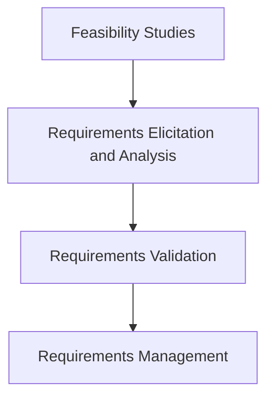

# MODULE-II: REQUIREMENTS ANALYSIS AND SPECIFICATION

## 1. Software Requirements

Software requirements are the features, functions, capabilities, and constraints that a software system must satisfy. They are the foundation for the entire software development process.

### Functional and Non-Functional Requirements

*   **Functional Requirements:**
    *   These define the specific behaviors or functions of the system. They describe what the system should *do*.
    *   Examples:
        *   The user shall be able to search for a customer by name.
        *   The system shall generate a sales report at the end of each day.
        *   The system shall allow users to pay via credit card.

*   **Non-Functional Requirements:**
    *   These define the quality attributes of the system. They describe *how* the system should perform its functions. They are constraints on the services or functions offered by the system.
    *   Examples:
        *   **Performance:** The system should respond to user queries within 2 seconds.
        *   **Security:** All user data must be encrypted.
        *   **Reliability:** The system must be available 99.9% of the time.
        *   **Usability:** A new user should be able to learn the basic functions of the system within 30 minutes.
        *   **Portability:** The application must be able to run on Windows, macOS, and Linux.

### User and System Requirements

*   **User Requirements:**
    *   Statements in natural language plus diagrams of the services the system provides and its operational constraints. Written for customers.
    *   They describe the user's goals or tasks that the system must support.

*   **System Requirements:**
    *   A structured document setting out detailed descriptions of the system's functions, services and operational constraints. Defines what should be implemented. It may be part of a contract between client and contractor.
    *   They are more detailed and specific than user requirements.

### Software Requirements Document (SRD)

A Software Requirements Document (or Specification - SRS) is a comprehensive description of the intended purpose and environment for a software system under development. It fully describes what the software will do and how it will be expected to perform.

#### Typical Structure:
1.  **Introduction:** Purpose, scope, definitions, system overview.
2.  **Overall Description:** Product perspective, product functions, user characteristics, constraints, assumptions.
3.  **Specific Requirements:** Functional requirements, non-functional requirements, interface requirements.
4.  **Appendices**
5.  **Index**

## 2. Requirement Engineering Process

Requirement Engineering is the process of defining, documenting, and maintaining requirements. It is a crucial phase in software development.

### Process Phases:

1.  **Feasibility Studies:**
    *   An analysis to determine if the proposed system is viable from a technical, economic, and operational standpoint.
    *   **Technical Feasibility:** Can the system be built with current technology?
    *   **Economic Feasibility:** Will the system provide a positive return on investment?
    *   **Operational Feasibility:** Will the new system be accepted and used by the users?

2.  **Requirements Elicitation and Analysis:**
    *   The process of gathering requirements from stakeholders (customers, users, etc.).
    *   **Techniques:**
        *   **Interviews:** Directly talking to stakeholders.
        *   **Questionnaires:** Collecting information from a large number of people.
        *   **Observation:** Watching users perform their tasks.
        *   **Prototyping:** Creating a working model of the system to get feedback.
        *   **Workshops:** Bringing stakeholders together to collaborate on requirements.
    *   During analysis, requirements are categorized, prioritized, and checked for consistency and completeness.

3.  **Requirements Validation:**
    *   The process of checking that the documented requirements are correct, complete, and consistent. It ensures that the requirements define the system that the customer really wants.
    *   **Techniques:**
        *   **Requirements Reviews:** A team of stakeholders manually reviews the requirements document.
        *   **Prototyping:** Users can experiment with a prototype to see if it meets their needs.
        *   **Test-Case Generation:** Developing tests for requirements can reveal problems.

4.  **Requirements Management:**
    *   The process of managing changing requirements during the requirements engineering process and system development.
    *   Requirements are bound to change, and it's essential to have a formal process for managing these changes. This involves change control processes and traceability.
    *   **Traceability:** The ability to describe and follow the life of a requirement, in both a forwards and backwards direction.

## 3. Classical Analysis

### Structured System Analysis

*   A method for analyzing and designing systems that focuses on the flow of data through the system.
*   It uses graphical tools to represent the system and its processes.
*   **Key Tool: Data Flow Diagrams (DFDs)**
    *   DFDs show how data moves through a system. They depict processes, data stores, external entities, and data flows.
    *   **Components:**
        *   **Process:** An activity that transforms data.
        *   **Data Flow:** The movement of data between processes, data stores, and external entities.
        *   **Data Store:** A place where data is stored.
        *   **External Entity:** A source or destination of data that is outside the system.

### Petri Nets

*   A mathematical modeling language for the description of distributed systems.
*   A Petri net is a directed bipartite graph, in which the nodes represent transitions (i.e., events that may occur, signified by bars) and places (i.e., conditions, signified by circles).
*   They are used to model the dynamic behavior of systems.

### Data Dictionary

*   A centralized repository of information about data such as meaning, relationships to other data, origin, usage, and format.
*   It is a key component of structured analysis. For every data flow and data store in a DFD, there is an entry in the data dictionary.
*   It provides a single source of truth for all data definitions in the system, ensuring consistency.