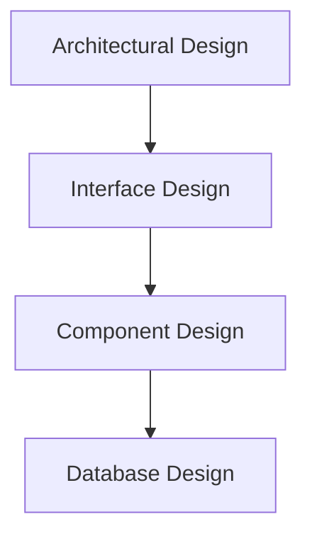

# MODULE-III: SOFTWARE DESIGN

## 1. The Design Process

Software design is the creative process of transforming a set of requirements into a detailed plan for constructing a software system. It is a crucial bridge between requirements analysis and implementation. Good design is the key to building a system that is not only functional but also reliable, maintainable, and scalable.

### Design Process Activities:
1.  **Architectural Design:** This is the high-level design phase where you define the overall structure of the system. It involves identifying the main components (e.g., database, user interface, business logic layer), their responsibilities, and how they will interact with each other. The output is a set of architectural diagrams and documents.
2.  **Interface Design:** This phase focuses on defining the interfaces between the system's components. This includes APIs (Application Programming Interfaces) for component-to-component communication, as well as the user interface (UI) for human-computer interaction. A well-defined interface is stable and easy to understand.
3.  **Component Design:** In this phase, you design the internal structure of each component identified during architectural design. This involves defining the data structures, algorithms, and control flow for each component.
4.  **Database Design:** This involves designing the logical and physical structure of the database that will store the system's data. This includes defining tables, columns, data types, relationships, and constraints.

## 2. Design Concepts

These are fundamental principles that guide the design process and help in creating high-quality software.

*   **Abstraction:** The practice of hiding the complexity of a system while exposing only the essential features. For example, when you use a library function, you only need to know its signature (what it does), not how it is implemented.
*   **Modularity:** The practice of breaking down a large system into smaller, independent, and interchangeable modules. High modularity (high cohesion within modules and low coupling between modules) makes a system easier to understand, develop, test, and maintain.
*   **Architecture:** The overall structure of the software. It defines the components, their relationships, and the principles that guide their design and evolution. A good architecture is essential for meeting the system's non-functional requirements.
*   **Patterns:** A design pattern is a general, reusable solution to a commonly occurring problem in software design. Patterns are not code; they are templates for how to solve a problem. Examples include the Singleton, Factory, and Observer patterns.
*   **Refinement:** The process of elaborating on a design, moving from a high-level, abstract view to a more detailed, concrete view. This is often done in a top-down manner, starting with the overall architecture and progressively refining each component.
*   **Information Hiding:** The principle of hiding the internal implementation details of a module from the outside world. This is achieved through encapsulation. It helps in reducing the impact of changes, as modifications to the internal implementation of a module do not affect other modules that use it.

## 3. The Design Model

The design model is a comprehensive representation of the software design. It consists of multiple views that describe the system from different perspectives.

### Elements of the Design Model:
*   **Data Design:** Creates a model of the data and information, often represented by an Entity-Relationship (ER) diagram.
*   **Architectural Design:** Represents the overall structure of the software, often visualized using architectural diagrams like component diagrams or deployment diagrams.
*   **Interface Design:** Describes the system's interfaces, including UI mockups and API specifications.
*   **Component-level Design:** Provides a detailed description of each component, often using class diagrams, sequence diagrams, or pseudocode.

## 4. Design Heuristics

These are general guidelines or rules of thumb that can help in making good design decisions.

*   **A design should be traceable to the analysis model:** There should be a clear link between the design components and the requirements they are intended to satisfy.
*   **A design should exhibit uniformity and integration:** The design should be consistent in its style and conventions.
*   **A design should be structured to accommodate change:** A good design is flexible and can be easily modified to meet new requirements.
*   **A design should be structured to degrade gently:** The system should not fail completely in the event of an error; it should handle errors gracefully.
*   **Design is not coding, coding is not design:** Design is about planning and problem-solving, while coding is about implementation. They are distinct activities.
*   **A design should be assessed for quality as it is being created:** Quality should be built into the design from the beginning, not added as an afterthought.
*   **A design should be reviewed to minimize conceptual errors:** Peer reviews are an effective way to identify and fix design flaws early.

## 5. Architectural Design

Architectural design is the process of defining a collection of hardware and software components and their interfaces to establish the framework for the development of a computer system.

### Architectural Styles
An architectural style is a high-level pattern that provides a framework for a family of systems.

*   **Data-centered architectures:** A central data store (e.g., a database) is the primary means of communication between components. **Example:** A modern web application with a central database.
*   **Data-flow architectures:** Data flows through a series of components, each of which performs a specific transformation. **Example:** A compiler, where the source code flows through lexical analysis, parsing, and code generation phases.
*   **Call and return architectures:** The system is structured as a hierarchy of components, with control flowing from higher-level components to lower-level ones. **Example:** A traditional monolithic application.
*   **Object-oriented architectures:** The system is composed of a collection of interacting objects, each of which encapsulates data and behavior.
*   **Layered architectures:** The system is organized into a set of layers, each of which provides a set of services to the layer above it. **Example:** The OSI model for network protocols.

### Architectural Mapping using Data Flow
This technique involves using the data flow diagrams (DFDs) created during the analysis phase to derive the software architecture. The DFDs are analyzed to identify transform flows (data flowing in, being processed, and flowing out) and transaction flows (a single data item triggering one of many possible process paths). These flows are then mapped to architectural components.

## 6. User Interface Design

User Interface (UI) design is the process of creating the visual and interactive aspects of a software application. The goal is to create a UI that is both aesthetically pleasing and easy to use.

### Interface Analysis
This involves understanding the users and their context.
*   **User Analysis:** Who are the users? What are their skills, experiences, and goals?
*   **Task Analysis:** What tasks do the users need to perform? What are the steps involved in each task?
*   **Content Analysis:** What information needs to be displayed on the interface?
*   **Environmental Analysis:** Where and how will the system be used?

### Interface Design Steps
1.  **Define interface objects and actions:** Identify the objects the user will interact with (e.g., buttons, menus) and the actions they can perform.
2.  **Define events:** Define the user actions (e.g., mouse clicks, key presses) that will trigger changes in the interface.
3.  **Depict each interface state:** Create mockups or prototypes to show how the interface will look in different states.
4.  **Indicate how the user interprets the state of the system:** The interface should provide clear feedback to the user about the system's state.

## 7. Component-level Design

Component-level design focuses on the detailed design of each individual component of the system.

### Designing Class-based Components (Object-Oriented Design)
*   **Identify design classes:** Identify the classes that will be needed to implement the system.
*   **Elaborate classes:** For each class, define its attributes (data) and methods (behavior).
*   **Define interfaces:** Specify the public methods that each class will expose to other classes.
*   **Describe processing flow:** Use tools like sequence diagrams or activity diagrams to describe the interactions between objects.

### Designing Traditional Components (Structured Design)
*   For each function or procedure, define its algorithm using pseudocode or flowcharts.
*   Define the data structures that the function will use.
*   Specify the function's interface (parameters and return value).