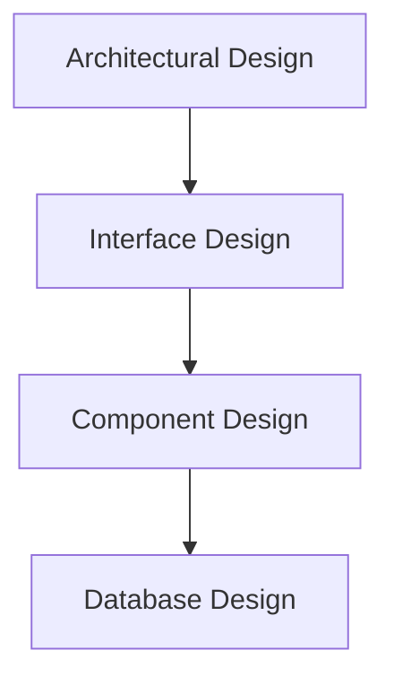

# MODULE-III: SOFTWARE DESIGN

## 1. The Design Process

Software design is the process of envisioning and defining software solutions to one or more sets of problems. It is the process of problem-solving and planning for a software solution. After the purpose and specifications of software are determined, software developers will design or employ designers to develop a plan for a solution.

### Design Process Activities:
1.  **Architectural Design:** Identifying the overall structure of the system, the principal components, their relationships, and how they interact.
2.  **Interface Design:** Defining how the system will interact with other systems, and with its users.
3.  **Component Design:** Taking the system components and designing them in detail. This may involve designing data structures and algorithms.
4.  **Database Design:** Designing the data structures that will be used by the system.

## 2. Design Concepts

These are fundamental concepts that guide the design process.

*   **Abstraction:** Hiding the complexity and showing only the essential features of the object.
*   **Modularity:** The degree to which a system's components may be separated and recombined. It is a logical partitioning of the software design that allows complex software to be manageable for the purpose of implementation and maintenance.
*   **Architecture:** The overall structure of the software. It provides a framework from which a more detailed design can be developed.
*   **Patterns:** A design pattern is a general reusable solution to a commonly occurring problem within a given context in software design.
*   **Refinement:** The process of elaboration. It is a top-down design strategy. A program is developed by successively refining levels of procedural detail.
*   **Information Hiding:** Hiding the implementation details of a component from its users. This reduces the complexity of the system.

## 3. The Design Model

The design model provides a variety of different views of the system, like an architect's plans for a house.

### Elements of the Design Model:
*   **Data Design:** Creates a model of the data and/or information that is represented at a high level of abstraction.
*   **Architectural Design:** Represents the overall structure of the software and the relationships between its major components.
*   **Interface Design:** Describes how the software communicates with systems that interoperate with it, and with humans who use it.
*   **Component-level Design:** Transforms structural elements of the software architecture into a procedural description of software components.

## 4. Design Heuristics

These are general guidelines or rules of thumb that can help in making design decisions.

*   **A design should be traceable to the analysis model.**
*   **A design should exhibit uniformity and integration.**
*   **A design should be structured to accommodate change.**
*   **A design should be structured to degrade gently, even when aberrant data, events, or operating conditions are encountered.**
*   **Design is not coding, coding is not design.**
*   **A design should be assessed for quality as it is being created, not after the fact.**
*   **A design should be reviewed to minimize conceptual (semantic) errors.**

## 5. Architectural Design

Architectural design represents the structure of the data and program components that are required to build a computer-based system.

### Architectural Styles
An architectural style is a named collection of architectural design decisions that are applicable in a given development context, constrain architectural design decisions that are specific to a particular system within that context, and elicit beneficial qualities in each resulting system.

*   **Data-centered architectures:** A data store (e.g., a database) resides at the center of this architecture and is accessed frequently by other components that update, add, delete, or modify data within the store.
*   **Data-flow architectures:** This architecture is applied when input data are to be transformed through a series of computational or manipulative components into output data.
*   **Call and return architectures:** This architectural style enables you to achieve a program structure that is relatively easy to modify and scale. (e.g., Main program/subprogram architectures, Remote procedure call architectures).
*   **Object-oriented architectures:** The components of a system encapsulate data and the operations that must be applied to manipulate the data.
*   **Layered architectures:** A number of different layers are defined, each accomplishing a specific set of functions.

### Architectural Mapping using Data Flow
A common approach to architectural design is to map the data flow diagrams from the analysis phase into a software architecture. This involves identifying clusters of processes in the DFD and mapping them to architectural components.

## 6. User Interface Design

User Interface (UI) design is the process of making interfaces in software or computerized devices with a focus on looks or style. Designers aim to create interfaces which users find easy to use and pleasurable.

### Interface Analysis
*   Understanding the users, tasks, content, and environment.
*   It means understanding:
    *   The people (users) who will interact with the system through the interface.
    *   The tasks that end users must perform to do their work.
    *   The content that is presented as part of the interface.
    *   The environment in which these tasks will be conducted.

### Interface Design Steps
1.  **Define interface objects and actions (operations).**
2.  **Define events (user actions) that will cause the state of the user interface to change.**
3.  **Depict each interface state as it will actually look to the end user.**
4.  **Indicate how the user interprets the state of the system from information provided through the interface.**

## 7. Component-level Design

Component-level design defines the data structures, algorithms, interface characteristics, and communication mechanisms allocated to each software component.

### Designing Class-based Components
*   **Identify all design classes that correspond to the problem domain.**
*   **Identify all design classes that correspond to the infrastructure domain.**
*   **Elaborate all design classes that are not acquired as reusable components.**
    *   Specify message details.
    *   Identify appropriate interfaces for each component.
    *   Elaborate attributes and define data types and data structures required to implement them.
    *   Describe processing flow within each operation in detail.

### Designing Traditional Components
*   The design of traditional components (e.g., functions, procedures) involves defining the algorithm, data structures, and interfaces for each component.
*   This is often done using structured programming techniques.