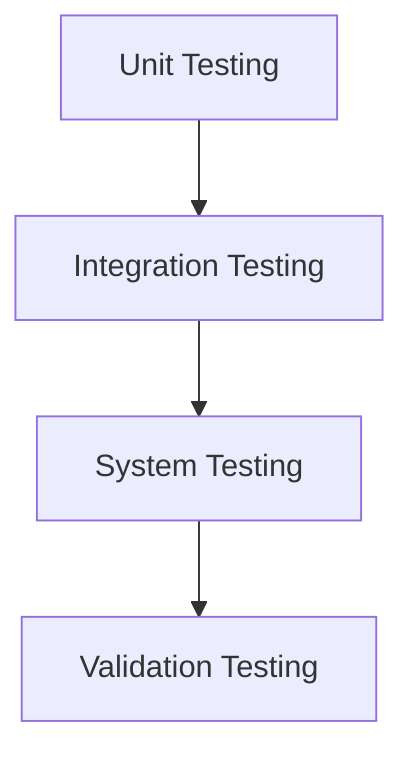

# MODULE-IV: TESTING AND MAINTENANCE

## 1. Software Testing Fundamentals

Software testing is a critical phase in the software development lifecycle. It is the process of executing a program or application with the intent of finding software bugs. It is an investigation conducted to provide stakeholders with information about the quality of the software product or service under test.

### Internal and External Views of Testing
*   **Internal View (White-box testing):** This approach focuses on the internal structure of the software. Testers have access to the source code and use their knowledge of the code to design test cases. It is also known as structural testing or glass-box testing.
*   **External View (Black-box testing):** This approach focuses on the functionality of the software without any knowledge of the internal implementation. Testers treat the software as a "black box" and provide inputs to see if the outputs are as expected. It is also known as behavioral testing.

## 2. White-Box Testing

White-box testing is a testing technique that evaluates the internal structure, design, and coding of software to verify the flow of input-output and to improve design, usability, and security.

### Basis Path Testing
*   A technique developed by Tom McCabe that uses the cyclomatic complexity of a program to determine the number of independent paths through the code.
*   **Steps:**
    1.  Draw a control flow graph from the code.
    2.  Calculate the cyclomatic complexity (V(G) = E - N + 2, where E is the number of edges and N is the number of nodes).
    3.  Identify the basis set of linearly independent paths.
    4.  Create a test case for each path.
*   This technique guarantees that every statement in the program is executed at least once.

### Control Structure Testing
*   **Condition Testing:** Focuses on testing the logical conditions in the code. For a condition like `(A > B) AND (C < D)`, it would test cases where the condition is true and false.
*   **Data Flow Testing:** Focuses on the lifecycle of variables (where they are defined, used, and destroyed). It helps to uncover bugs related to variable usage.
*   **Loop Testing:** Focuses on the validity of loop constructs. It involves testing simple loops, nested loops, and concatenated loops. Test cases are designed to check the loop initialization, execution, and termination.

## 3. Black-Box Testing

Black-box testing is a testing technique that focuses on the functional requirements of the software. It is performed from the end-user's perspective.

### Techniques:
*   **Equivalence Partitioning:** A technique where the input data is divided into partitions of equivalent data. If a test case in a partition reveals a bug, it is assumed that all other test cases in that partition would reveal the same bug. **Example:** For a field that accepts ages from 18 to 60, the partitions would be < 18, 18-60, and > 60.
*   **Boundary Value Analysis (BVA):** A technique that focuses on testing the boundaries between partitions. It is based on the principle that most errors occur at the boundaries. **Example:** For the age field, the boundary values would be 17, 18, 19, 59, 60, and 61.
*   **Decision Table Testing:** A technique used to test systems with complex logic. A decision table is created with columns for conditions and rows for rules (combinations of conditions) and their corresponding actions.

## 4. Regression Testing

Regression testing is the process of re-running functional and non-functional tests to ensure that previously developed and tested software still performs correctly after a change. The change could be a bug fix, a new feature, or a configuration change. Regression testing is a critical part of the software maintenance process.

## 5. Levels of Testing

### Unit Testing
*   Testing individual components or modules of the software in isolation.
*   It is typically done by developers.
*   The goal is to verify that each unit of the software performs as designed.
*   Frameworks like JUnit (for Java) and NUnit (for .NET) are commonly used.

### Integration Testing
*   Testing the interfaces between integrated components.
*   The goal is to expose faults in the interaction between components.
*   **Approaches:**
    *   **Big Bang:** All components are integrated at once and then tested.
    *   **Top-down:** Testing proceeds from the top-level modules downwards. Stubs are used to simulate lower-level modules.
    *   **Bottom-up:** Testing proceeds from the bottom-level modules upwards. Drivers are used to simulate higher-level modules.

### Validation Testing
*   Testing to ensure that the software meets the customer's requirements.
*   It answers the question: "Are we building the right product?"
*   This is often done through user acceptance testing (UAT), where the end-users test the software to see if it meets their needs.

### System Testing
*   Testing the complete and integrated software system.
*   The goal is to evaluate the system's compliance with the specified requirements.
*   It is a form of black-box testing.
*   Types of system testing include performance testing, security testing, and usability testing.

### Debugging
*   The process of finding and fixing defects in the software.
*   It is a reactive process that begins after a bug has been reported.
*   **Debugging Process:**
    1.  Reproduce the bug.
    2.  Isolate the cause of the bug.
    3.  Fix the bug.
    4.  Verify the fix.

## 6. Software Implementation Techniques

### Coding Practices
*   A set of guidelines for writing high-quality code.
*   **Examples:**
    *   **DRY (Don't Repeat Yourself):** Avoid duplicating code.
    *   **KISS (Keep It Simple, Stupid):** Write simple, easy-to-understand code.
    *   **YAGNI (You Ain't Gonna Need It):** Don't add functionality until it is necessary.
    *   Use a consistent coding style (e.g., Google Style Guides).

### Refactoring
*   The process of improving the internal structure of the code without changing its external behavior.
*   The goal is to make the code more readable, maintainable, and efficient.
*   **Common Refactoring Techniques:**
    *   **Extract Method:** Turn a code fragment into its own method.
    *   **Rename Variable:** Change the name of a variable to be more descriptive.
    *   **Replace Magic Number with Symbolic Constant:** Replace a hard-coded number with a named constant.

## 7. Maintenance and Reengineering

### Software Maintenance
*   The process of modifying a software system after it has been delivered to the customer.
*   **Types of Maintenance:**
    *   **Corrective:** Fixing bugs.
    *   **Adaptive:** Modifying the system to work in a new environment (e.g., a new operating system).
    *   **Perfective:** Adding new features or improving the performance of the system.
    *   **Preventive:** Making changes to the software to prevent future problems (e.g., refactoring).

### Reengineering
*   The process of rebuilding an existing system to improve its quality.

#### BPR Model (Business Process Reengineering)
*   A radical redesign of business processes to achieve dramatic improvements in performance.

#### Reengineering Process Model
1.  **Business Process Analysis:** Analyze the existing business processes to identify areas for improvement.
2.  **Reverse Engineering:** Analyze the existing system to understand its design and functionality.
3.  **Forward Engineering:** Re-implement the system with an improved design.

#### Reverse and Forward Engineering
*   **Reverse Engineering:** The process of analyzing a system to understand its components and their relationships.
*   **Forward Engineering:** The traditional process of building a system from requirements to implementation.