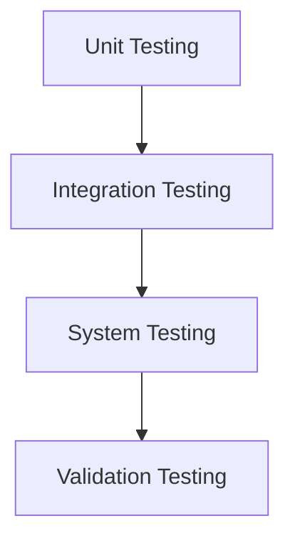

# MODULE-IV: TESTING AND MAINTENANCE

## 1. Software Testing Fundamentals

Software testing is the process of evaluating and verifying that a software product or application does what it is supposed to do. The benefits of testing include preventing bugs, reducing development costs and improving performance.

### Internal and External Views of Testing
*   **Internal View (White-box testing):** Testing based on an internal perspective of the system, i.e., its code and structure.
*   **External View (Black-box testing):** Testing based on an external perspective of the system, i.e., its functionality, without knowledge of its internal workings.

## 2. White-Box Testing

White-box testing (also known as clear box testing, glass box testing, transparent box testing, and structural testing) is a method of software testing that tests internal structures or workings of an application, as opposed to its functionality.

### Basis Path Testing
*   A white-box testing technique that enables the test case designer to derive a logical complexity measure of a procedural design and use this measure as a guide for defining a basis set of execution paths.
*   Test cases derived to exercise the basis set are guaranteed to execute every statement in the program at least one time.

### Control Structure Testing
*   A group of white-box testing techniques that focus on the control structures of a program.
*   **Condition Testing:** A test case design method that exercises the logical conditions contained in a program module.
*   **Data Flow Testing:** Selects test paths of a program according to the locations of definitions and uses of variables in the program.
*   **Loop Testing:** A white-box testing technique that focuses exclusively on the validity of loop constructs.

## 3. Black-Box Testing

Black-box testing is a method of software testing that examines the functionality of an application without peering into its internal structures or workings. This method of test can be applied to virtually every level of software testing: unit, integration, system and acceptance.

### Techniques:
*   **Equivalence Partitioning:** Divides the input data of a software unit into partitions of equivalent data from which test cases can be derived.
*   **Boundary Value Analysis:** A software testing technique in which tests are designed to include representatives of boundary values in a range.
*   **Decision Table Testing:** A systematic approach where the different input combinations and their corresponding system behavior (output) are captured in a tabular form.

## 4. Regression Testing

Regression testing is a type of software testing which verifies that software which was previously developed and tested still performs the same way after it was changed or interfaced with other software.

## 5. Levels of Testing

### Unit Testing
*   A level of software testing where individual units/components of a software are tested. The purpose is to validate that each unit of the software performs as designed.

### Integration Testing
*   A level of software testing where individual units are combined and tested as a group. The purpose of this level of testing is to expose faults in the interaction between integrated units.

### Validation Testing
*   The process of checking whether the software product is up to the mark or in other words product has high level requirements. It is a process of checking the validation of product, not the verification of product.

### System Testing
*   A level of software testing where a complete and integrated software is tested. The purpose of this test is to evaluate the system's compliance with the specified requirements.

### Debugging
*   Debugging is the process of finding and resolving defects or problems within a computer program that prevent correct operation of computer software or a system.

## 6. Software Implementation Techniques

### Coding Practices
*   A set of informal, recommended guidelines that a software development team can use to improve the quality of their code.
*   Examples:
    *   Consistent indentation and formatting.
    *   Meaningful variable and function names.
    *   Writing comments where necessary.
    *   Keeping functions short and focused.

### Refactoring
*   The process of restructuring existing computer code—changing the factoring—without changing its external behavior. Refactoring is intended to improve nonfunctional attributes of the software.
*   Advantages include improved code readability and reduced complexity.

## 7. Maintenance and Reengineering

### Software Maintenance
*   The modification of a software product after delivery to correct faults, to improve performance or other attributes.
*   **Types of Maintenance:**
    *   **Corrective:** Correcting discovered problems.
    *   **Adaptive:** Modifying the system to cope with changes in the software environment.
    *   **Perfective:** Implementing new or changed user requirements.
    *   **Preventive:** Making changes to software to prevent future problems.

### Reengineering
*   The examination and alteration of a subject system to reconstitute it in a new form and the subsequent implementation of the new form.

#### BPR Model (Business Process Reengineering)
*   The radical redesign of core business processes to achieve dramatic improvements in productivity, cycle times and quality.

#### Reengineering Process Model
1.  **Business Process Analysis:** The existing business processes are analyzed.
2.  **Reverse Engineering:** The system is analyzed to understand its design and specifications.
3.  **Forward Engineering:** The system is re-implemented from the new specifications.

#### Reverse and Forward Engineering
*   **Reverse Engineering:** The process of analyzing a subject system to identify the system's components and their interrelationships and create representations of the system in another form or at a higher level of abstraction.
*   **Forward Engineering:** The traditional process of moving from high-level abstractions and logical, implementation-independent designs to the physical implementation of a system.